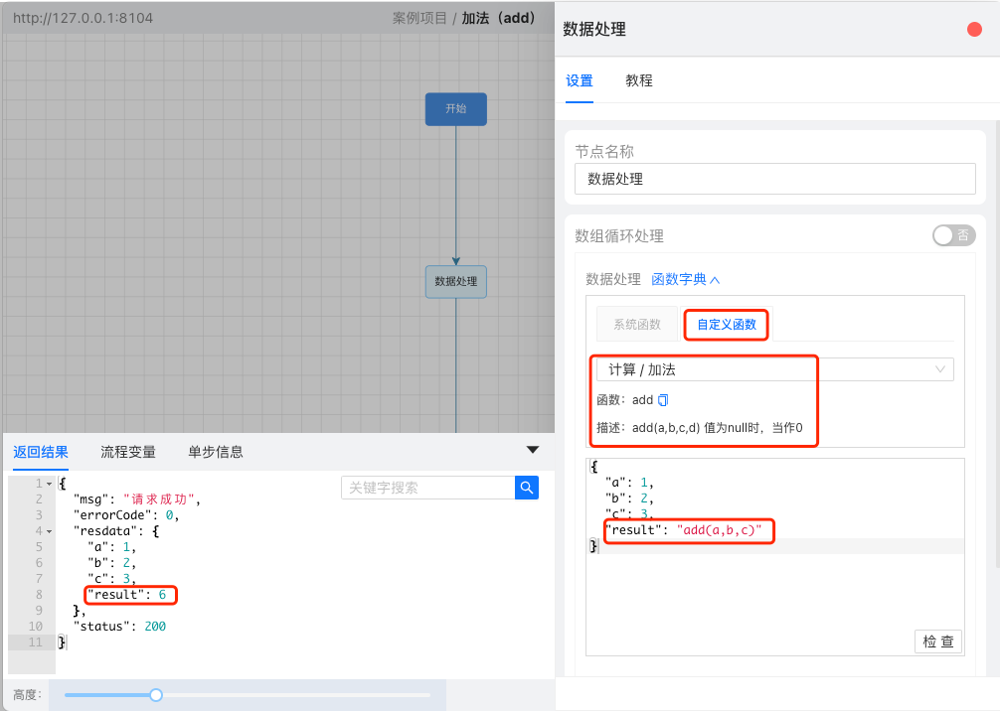

# 函数扩展

实现接口** ICustomFunction** ，重写其方法，在类上加注解 **@Service**，重启当前项目，即可在工作台中使用该拓展函数。

### 方法说明

**String getTitle();**
函数中文名称，如：字符串截取

**String getName();**
函数英文名称，也是函数唯一标识，如：strSubstring，实战中也是通过此名称调用该函数。

**String getDesc();**
描述，解释函数用法，如 strSubstring(str,beginIndex,endIndex)，截取 str 从下标 beginIndex 到 endIndex 之间到字符串
ps: 换行使用<br/>

**String getType();**
类型，如：字符串处理。(建议使用统一枚举管理函数类型)

**Object doFunction(FunctionContent content);**
执行逻辑：
1.获取到待处理的参数;  2.处理;  3.返回结果数据

获取参数代码：`List<Object> parameters = content.getParameters();`

如 strSubstring(str,beginIndex,endIndex)，将会有三个参数：str、beginIndex、endIndex
则 content.getParameter(0) 是 str
content.getParameter(1) 是 beginIndex
content.getParameter(2) 是 endIndex

建议添加的校验代码：
**if (parameters == null || parameters.size() < xxx ) {**
**            return **null**;**
**   	}**

### 示例
```java
@Service
public class Add1Fun implements ICustomFunction {

    @Override
    public String getTitle() {
        return "加法";
    }

    @Override
    public String getName() {
        return "add";
    }

    @Override
    public String getDesc() {
        return "add(a,b,c,d) 值为 null 时，当作 0";
    }

    @Override
    public String getType() {
        return "计算";
    }

    @Override
    public Object doFunction(FunctionContent content) {
        List<Object> parameters = content.getParameters();
        if (parameters == null || parameters.size() < 2) {
            return null;
        }
        String firstNum;
        if (content.getParameter(0) == null) {
            firstNum = "0";
        }else {
            firstNum = StrUtils.GetNum(content.getParameter(0));
        }
        BigDecimal bigDecimal = new BigDecimal(firstNum);
        for (int i = 1; i < parameters.size(); i++) {
            String addedValue = "0";
            Object addedValueObj = parameters.get(i);
            if(addedValueObj != null){
                addedValue = addedValueObj.toString();
            }
            String num = StrUtils.GetNum(addedValue);
            bigDecimal = bigDecimal.add(new BigDecimal(num));
        }
        return NumberUtils.formatNum(bigDecimal);
    }
}
```
### 实战展示


