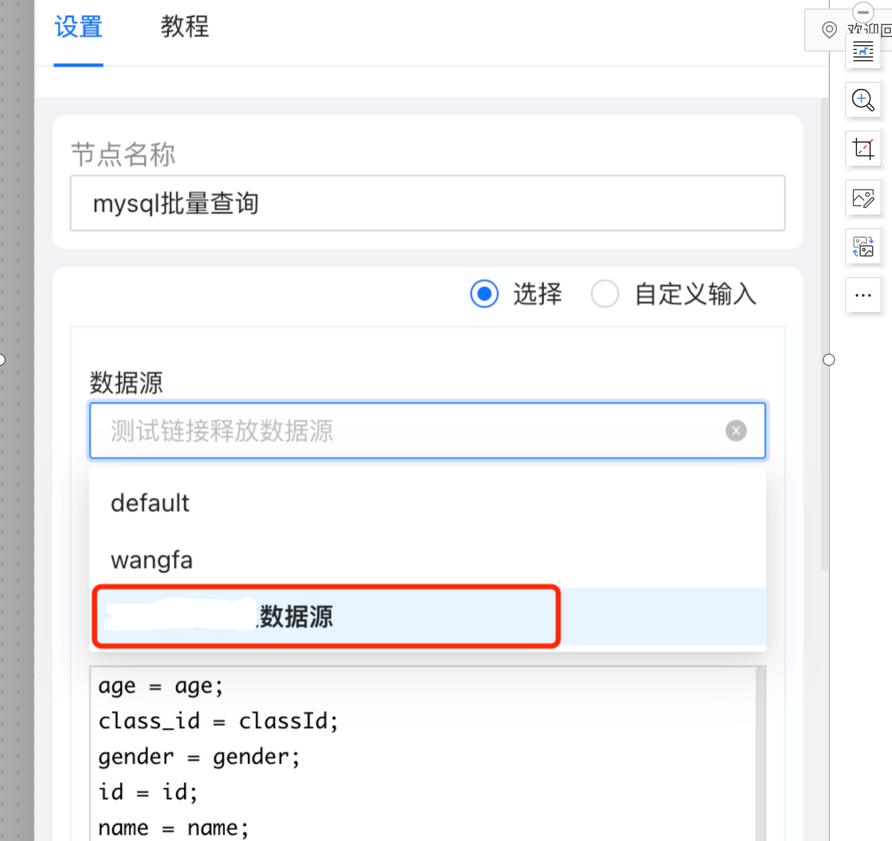
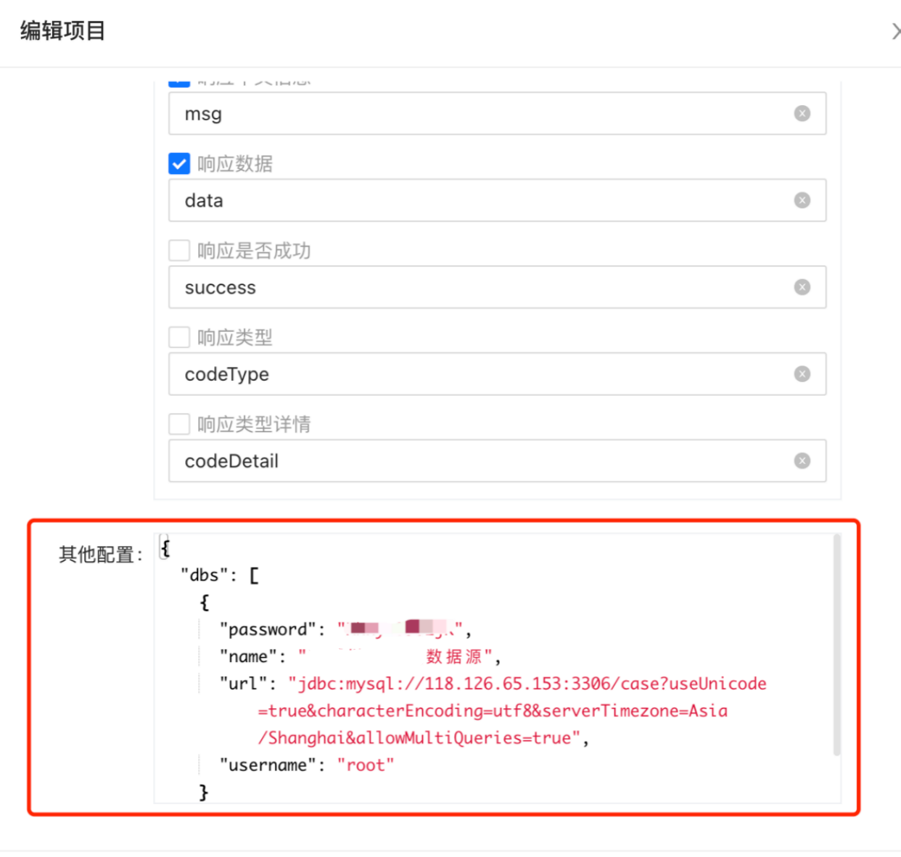
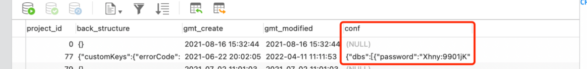

# 动态数据源
## 适用场景
适合不方便在工程配置文件(yml 或 properties)里直接配置数据源的场景。
## 步骤

1. 项目配置里添加数据源信息


2. 无需重启项目，即可使用该数据源进行开发，相关组件里都会有该数据源可选择。


3. 上线时全局修改数据源信息

项目发布到生产环境时，该数据源的 url、username、password 跟开发环境的信息可能是不一样的，只需要对生产环境的项目配置信息(lowcode_project_conf 表的 conf 字段)进行修改即可。name 不可修改，因为接口是按照 name 去使用对应数据源的，这样就不影响具体接口逻辑，实现了动态数据源。

### 注意事项
常规情况，建议还是将数据源信息配置到工程的配置文件里。接入了海牛引擎项目的多数据源配置方式如下

```java
manatee:
  dbs:
    - datasource:
        name: xxxx 数据源 1
        driverClassName: xxx
        username: xxx
        password: xxxx
        url: jdbc:dm://xxx.x.xx.xx:xxx/xxxx?zeroDateTimeBehavior=convertToNull&useUnicode=true&characterEncoding=utf-8
    - datasource:
        name: xxxx 数据源 2
        driverClassName: xxx
        username: xxx
        password: xxxx
        url: jdbc:dm://xxx.x.xx.xx:xxx/xxxx?zeroDateTimeBehavior=convertToNull&useUnicode=true&characterEncoding=utf-8
```
