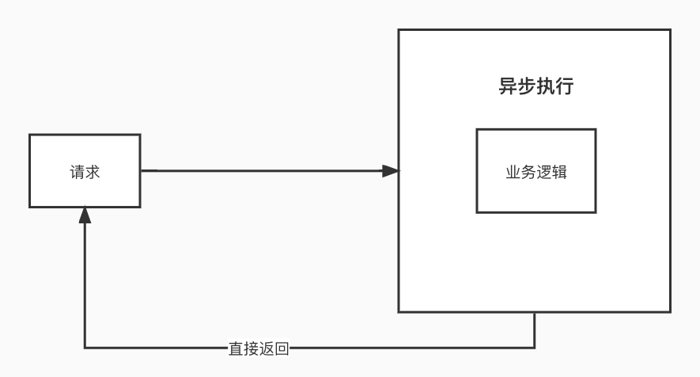
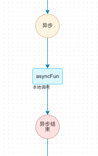
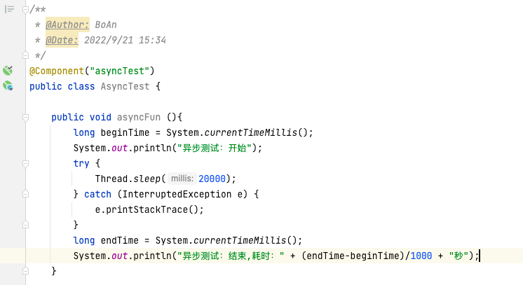
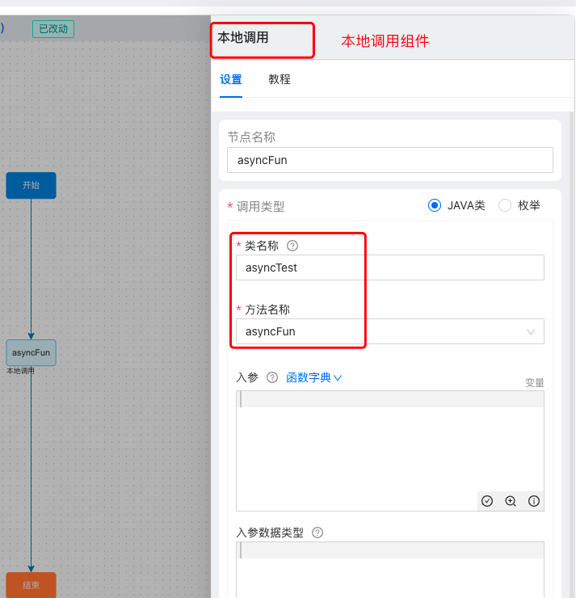
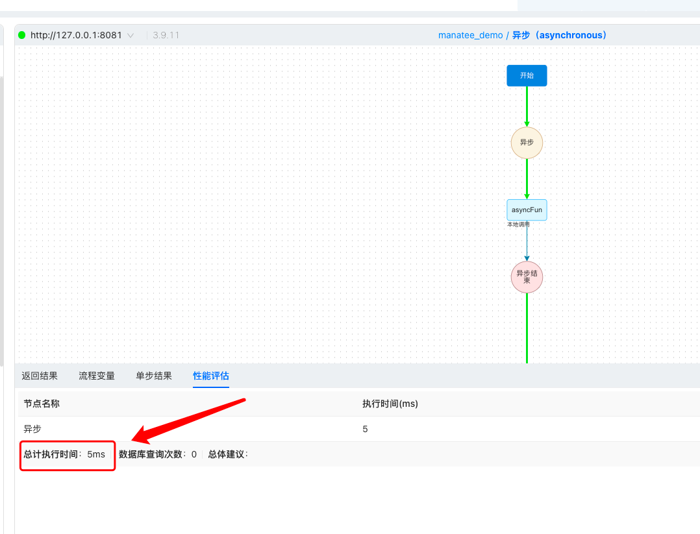
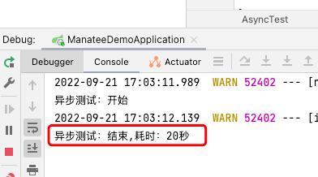

# 异步
## 集成
引入依赖
```java
        <dependency>
            <groupId>com.manatee.manatee-lowcode</groupId>
            <artifactId>lowcode-thread</artifactId>
            <version>${lowcode.version}</version>
        </dependency>
```
## 使用

### 在海牛中使用异步组件
异步组件需要和异步结束组件一起使用，将要异步的流程放在之间，则可完成异步处理。

### 示例
异步执行一段 20s 的逻辑，接口直接返回
#### 1.准备一个耗时 20s 的方法

#### 2.本地调用组件调用该方法

#### 3.使用异步组件，并调试



可以看到接口是直接返回的，耗时 5ms。而逻辑异步运行花费了 20s。

