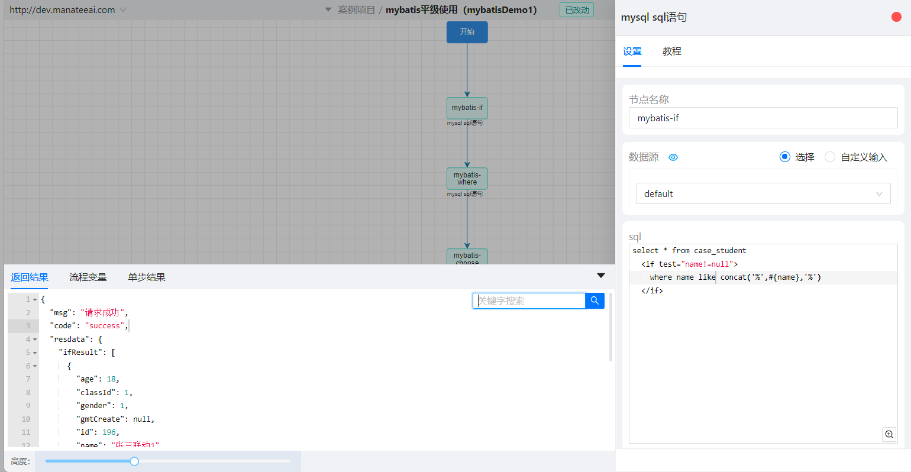
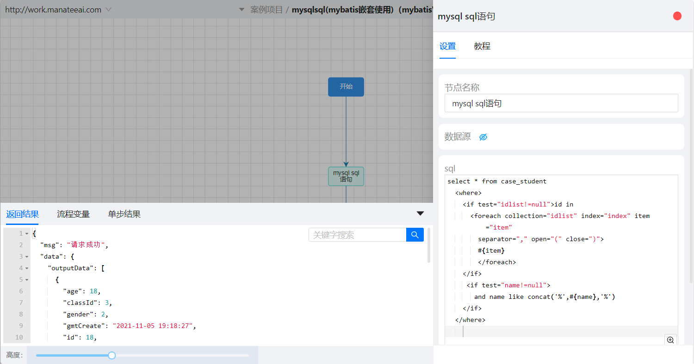
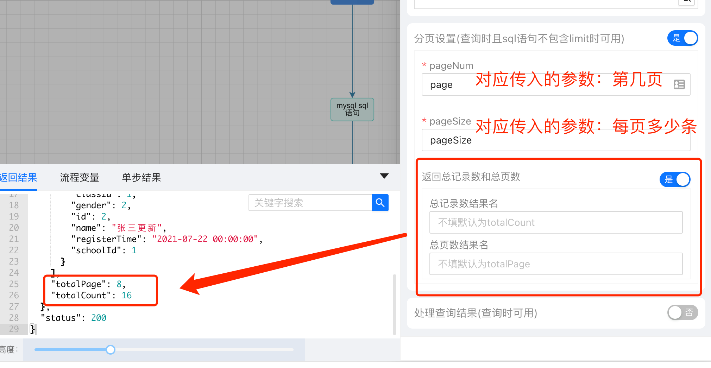
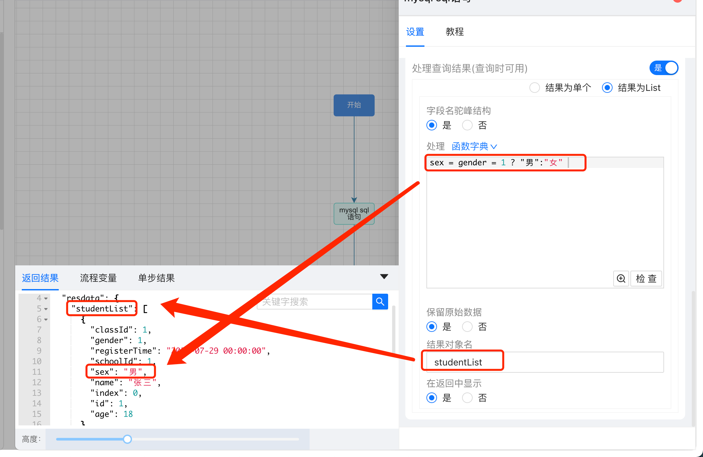

# MySQL SQL

### Mybatis 方式：
`支持 mybatis： <if> 、<where>  、<choose>  、<foreach> 、 <bind> 等标签`
#### 场景一：条件查询
参数输入：
```json
{
  "name": "张三联动 1"
}
```
MySQL SQL 输入：
```sql
select * from case_student
  <if test="name!=null">
    where name like concat('%',#{name},'%')
  </if>  
```
查询结果：
```json
{
    "ifResult": [
      {
        "age": 18,
        "classId": 1,
        "gender": 1,
        "gmtCreate": null,
        "id": 196,
        "name": "张三联动 1"
      },
      {
        "age": 20,
        "classId": 1,
        "gender": 0,
        "gmtCreate": null,
        "id": 197,
        "name": "张三联动 1"
      }
    ]
  }
```
#### 

#### 场景二：in 查询
参数输入：
```json
{
  "idlist": [
    53,
    54
  ]
}
```
MySQL SQL 输入：
```sql
select * from case_student
  <where>  
    <if test="idlist!=null">id in
      <foreach collection="idlist" index="index" item="item"
        separator="," open="(" close=")">
        #{item}
        </foreach>
    </if>
     <if test="name!=null">
       and name like concat('%',#{name},'%')
    </if> 
  </where>
```
查询结果：
```json
{
    "outputData": [
      {
        "age": 19,
        "classId": 1,
        "gender": 1,
        "gmtCreate": "1970-01-01 14:16:38",
        "id": 53,
        "name": "张三"
      },
      {
        "age": 18,
        "classId": 1,
        "gender": 1,
        "gmtCreate": "1970-01-01 14:16:41",
        "id": 54,
        "name": "张三"
      }
    ]
  }
```

### 
### 分页查询
在分页设置里配置分页参数，选择是否返回总记录数和总页数


### 处理返回结果
可以对上面 sql 查询出的结果数据进行处理，如：字段的新增或者数据变更；
可以指定返回结果的对象名。

