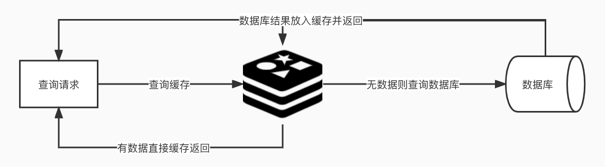
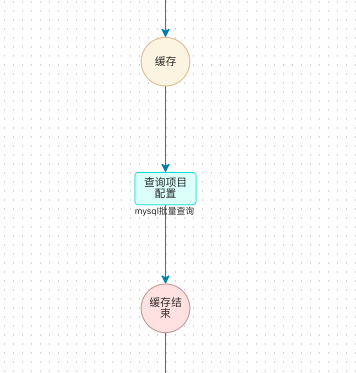
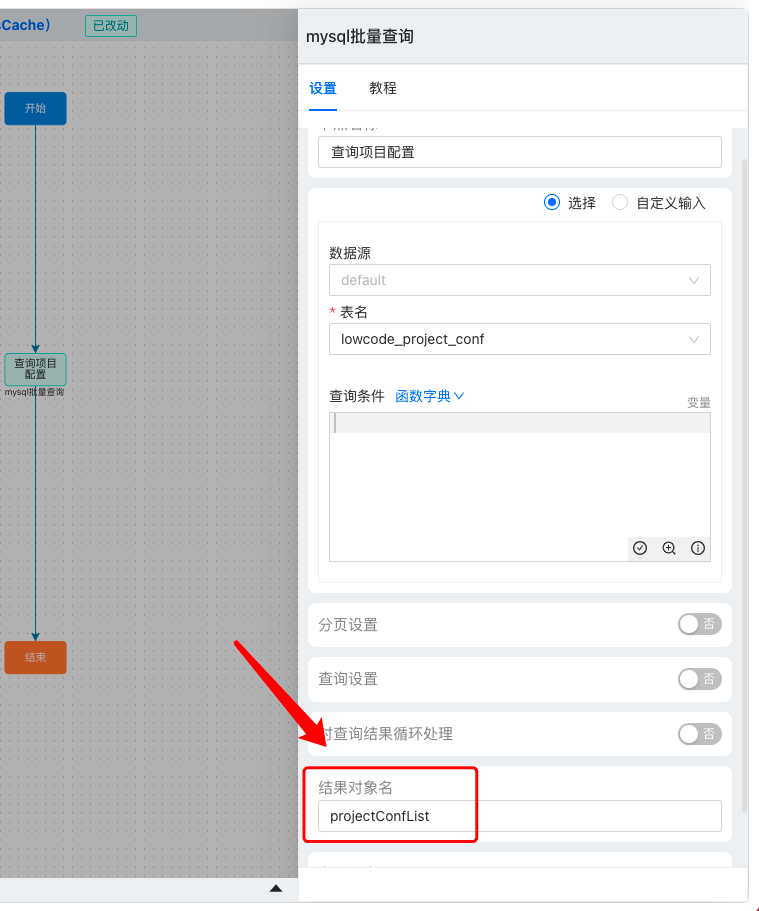
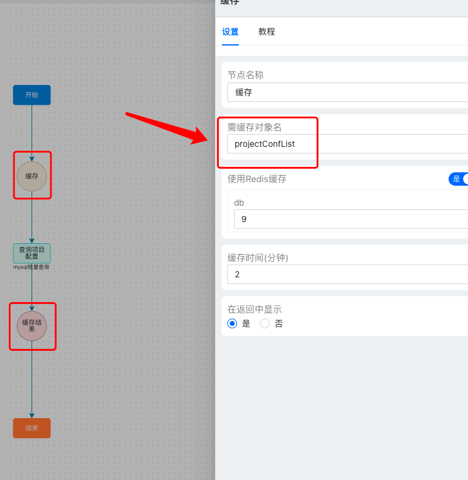
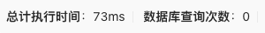
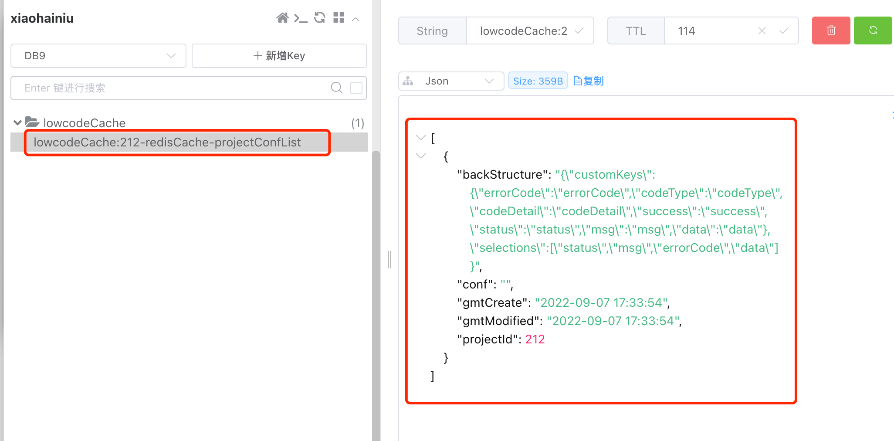

# Redis

## 集成
引入依赖
```java
        <dependency>
            <groupId>com.manatee.manatee-lowcode</groupId>
            <artifactId>lowcode-redis</artifactId>
            <version>${lowcode.version}</version>
        </dependency>
```
配置文件：
```yaml
spring: //放在 spring 下
  redis:
    password: xxxxxx
    host: xx.xx.xx.xx
    port: 6379
```
## 使用

### 在海牛中使用缓存组件
缓存组件需要和缓存结束组件一起使用，将要缓存的流程放在之间，并指定要缓存的对象名，则可完成缓存。

### 示例
查询项目配置(projectConfList)并缓存
#### 1.使用 MySQL 批量查询组件，查询 projectConfList

无缓存时，结果由查询数据库所得，响应时间为 125ms。

#### 2.使用缓存组件，缓存 projectConfList

有缓存时，结果由查询缓存所得，响应时间有缩短。

查看 redis 库的内容，看到缓存成功。


