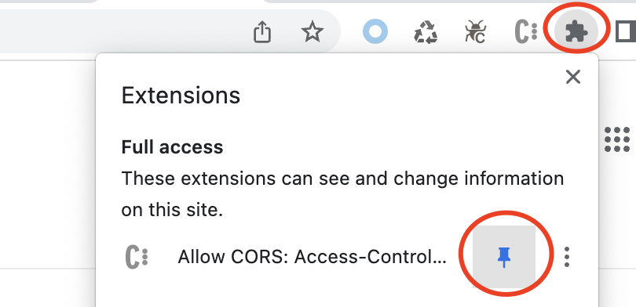

# 跨域

## 背景

为了方便快捷地体验、试用海牛，我们整理了一套方法，使得你在公司内部或者本地电脑将海牛的引擎[部署-链接]安装到相应的项目中后，就可以马上可以体验海牛的模块化开发。方法如下：

假设你的电脑现在是可以访问你安装了海牛引擎的项目的，打开[海牛工作台](http://work.manateeai.com/#/)，将该项目的地址[添加进来-链接]。编辑好接口后，点`调试`或 `发布`都会直接从浏览器向发送相关配置以让该项目中的`海牛引擎`执行相应的逻辑以返回对应的结果。

不过这个过程中会有个问题：因为浏览器跨域限制，来自公网 `work.manateeai.com` 域名的海牛工作台是不能请求你的项目地址的，所以，为了快速体验测试的需要，你需要安装一个叫 `Allow CORS: Access-Control-Allow-Origin` 的 Chrome 插件来让 Chrome 浏览器没有这个限制。

:::note
为了更好的兼容性，推荐你使用 Chrome 浏览器
:::

## 插件安装
Chrome 商店：https://chrome.google.com/webstore/detail/allow-cors-access-control/lhobafahddgcelffkeicbaginigeejlf 

如果访问有问题，可以点这里[下载](../../../static/download/chrome-extension/Chrome-Extentsion-Allow-CORS_v0.1.8%202.zip)，压缩包里附带了安装说明。

## 使用
安装好后，可以将插件固定在浏览器地址栏后面方便后面开关。

点击插件图标，在弹窗左侧点击来开关插件，灰色表示`关`，彩色表示`开`

## 其他方式
工程里，放行 `OPTIONS` 请求

