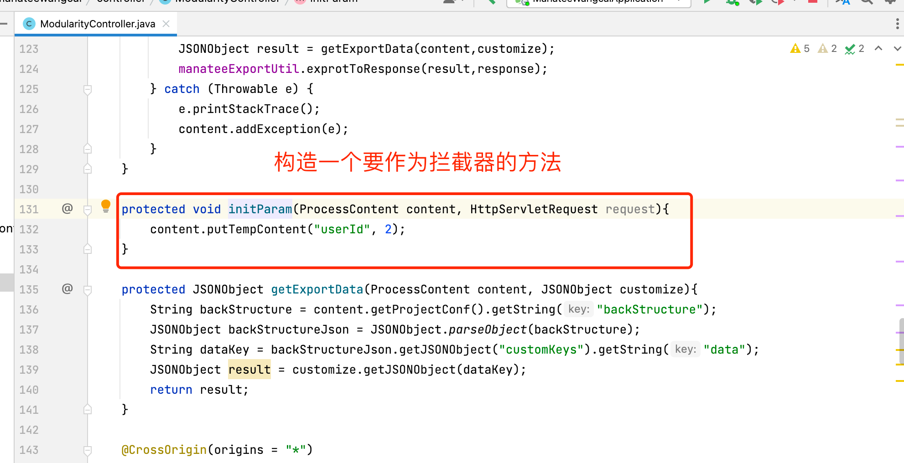
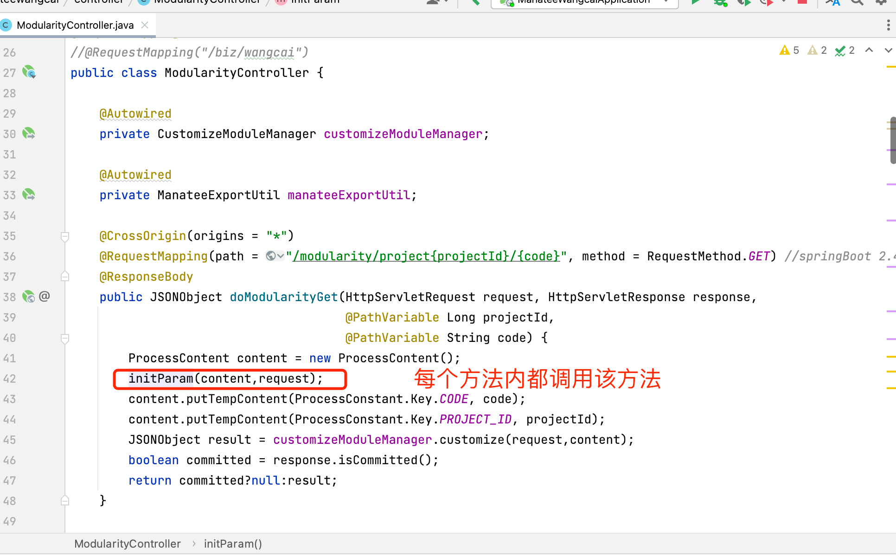
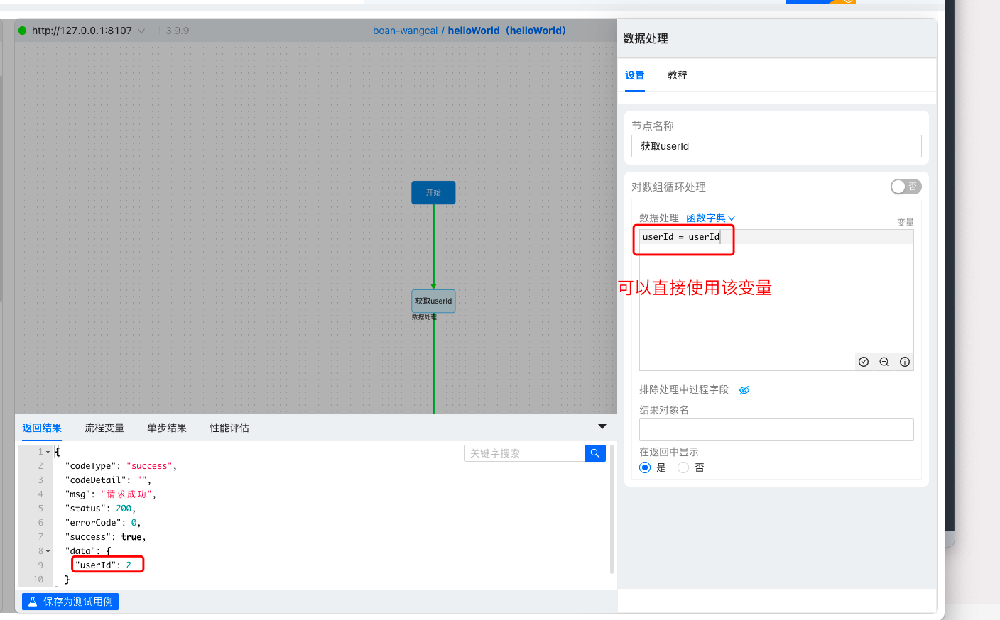

# 接口拦截器

## 原理
ModularityController 是海牛接口的入口，所有的海牛接口都会进入到这个 ModularityController，里面包含了 GET、POST 以及上传下载文件等形式的方法，每个方法所做的事情都是一样的：初始化参数，并传递参数给海牛引擎去执行，以及返回结果。

所以要对海牛接口进行拦截处理，只需要在这里补充拦截逻辑就行，比如获取用户信息以及权限相关操作。 根据 url 上带进来的 code 参数，可以针对到具体接口做处理。

通过` content.putTempContent("xxxKey", xxxValue);` 可以直接将指定参数写入流程图的上下文中，在用流程图开发时，可以直接使用该参数。
## 示例

