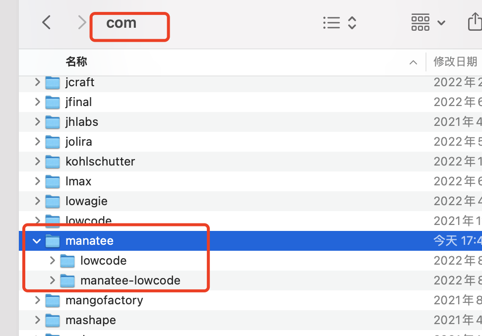

# 项目安装
## 视频演示
<iframe src="//player.bilibili.com/player.html?aid=985276876&bvid=BV1Yt4y177vy&cid=826370612&page=1" scrolling="no" border="0" frameborder="no" framespacing="0" allowfullscreen="true" width = "800px" height="600px">工程接入海牛</iframe>


## 项目接入
### 项目数据库初始化

在自己的数据库里初始化以下脚本，包含了`lowcode_base_module`、`lowcode_project_conf`表，和一些系统数据。

[数据库脚步.sql](https://www.yuque.com/attachments/yuque/0/2022/sql/12452833/1665736181143-273e74a5-a619-409a-9bee-a460f179fa90.sql?_lake_card=%7B%22src%22%3A%22https%3A%2F%2Fwww.yuque.com%2Fattachments%2Fyuque%2F0%2F2022%2Fsql%2F12452833%2F1665736181143-273e74a5-a619-409a-9bee-a460f179fa90.sql%22%2C%22name%22%3A%22%E6%95%B0%E6%8D%AE%E5%BA%93%E8%84%9A%E6%AD%A5.sql%22%2C%22size%22%3A78724%2C%22type%22%3A%22%22%2C%22ext%22%3A%22sql%22%2C%22source%22%3A%22%22%2C%22status%22%3A%22done%22%2C%22mode%22%3A%22title%22%2C%22download%22%3Atrue%2C%22taskId%22%3A%22ua24619f6-0f73-4372-aa2a-d1a83937aac%22%2C%22taskType%22%3A%22upload%22%2C%22__spacing%22%3A%22both%22%2C%22id%22%3A%22udafd368b%22%2C%22margin%22%3A%7B%22top%22%3Atrue%2C%22bottom%22%3Atrue%7D%2C%22card%22%3A%22file%22%7D)
### 安装依赖
#### 本地 jar 包形式(简单快捷，试用时推荐该方式)
[3.9.12_manatee.zip](https://manateeai.oss-cn-hangzhou.aliyuncs.com/deploy/%E5%BC%95%E6%93%8E%E5%8E%86%E5%8F%B2%E7%89%88%E6%9C%AC/3.9.12_manatee.zip)

解压后，将 manatee 文件夹放在自己本地 maven 仓库的 com 目录下。如下图所示

#### 企业 maven 私库形式
为了保持大家同一环境下的统一，和更新优化上的高效，可以指定一个人负责跟海牛这边对接依赖的源码工程，每次拉到最新版本后，再推送到自己团队的环境下。
####  中央仓库形式
暂未支持，敬请期待。

### 项目配置
#### 引入依赖
```java
//maven 依赖    
<dependency>
    <groupId>com.manatee.manatee-lowcode</groupId>
    <artifactId>lowcode-impl</artifactId>
    <version>3.9.12-SNAPSHOT</version>
</dependency>

//gradle 依赖
implementation 'com.manatee.manatee-lowcode:lowcode-impl:3.9.12-SNAPSHOT'
//ps:repositories 配置了 mavenLocal()
```
#### 配置 springBoot 启动类扫描路径
`@ComponentScan({"com.manatee"})`

注意：如果原来没有配置过扫描，需要把当前项目的目录也配置进去
#### 项目导入 ModularityController.java 文件
[ModularityController.java](https://www.yuque.com/attachments/yuque/0/2022/java/12452833/1666431255653-a1c1e5c2-2c8d-49cc-adef-78d247c876cb.java?_lake_card=%7B%22src%22%3A%22https%3A%2F%2Fwww.yuque.com%2Fattachments%2Fyuque%2F0%2F2022%2Fjava%2F12452833%2F1666431255653-a1c1e5c2-2c8d-49cc-adef-78d247c876cb.java%22%2C%22name%22%3A%22ModularityController.java%22%2C%22size%22%3A11153%2C%22type%22%3A%22%22%2C%22ext%22%3A%22java%22%2C%22source%22%3A%22%22%2C%22status%22%3A%22done%22%2C%22download%22%3Atrue%2C%22taskId%22%3A%22u99bbff9f-b616-4a72-83d4-b81b5683ca3%22%2C%22taskType%22%3A%22upload%22%2C%22__spacing%22%3A%22both%22%2C%22id%22%3A%22ub9de6f96%22%2C%22margin%22%3A%7B%22top%22%3Atrue%2C%22bottom%22%3Atrue%7D%2C%22card%22%3A%22file%22%7D)

#### 权限设置
开发环境下需要放行 `/biz/modularity/**` 和`/biz/customizeModule.do/**`路径
