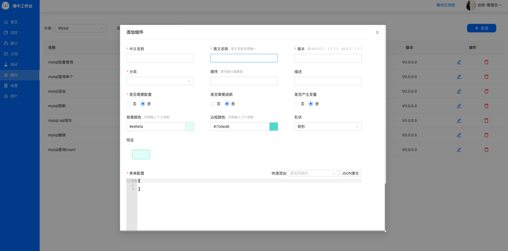
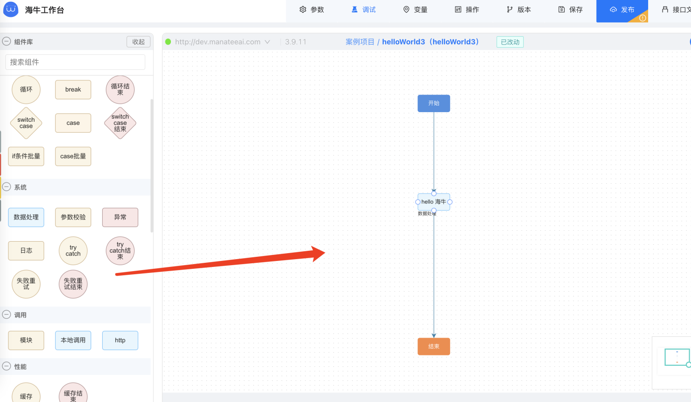
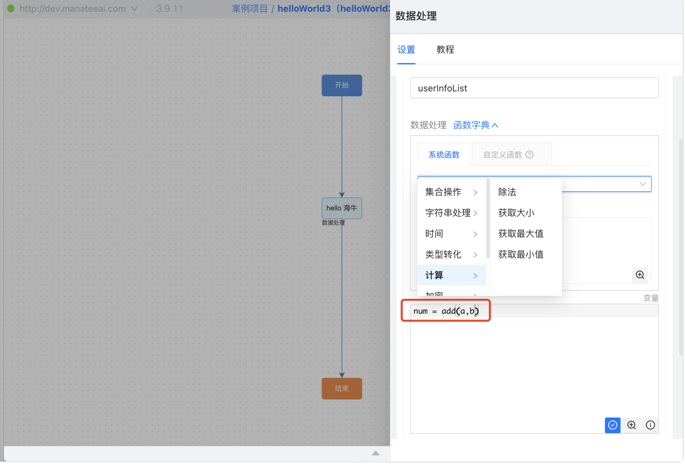
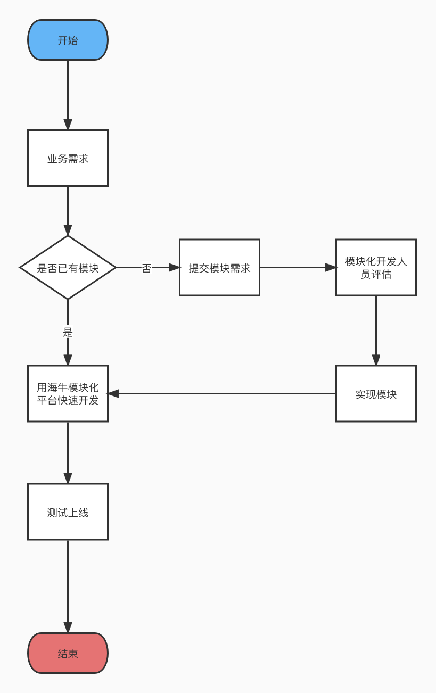

# 海牛模块化开发简介

## 3 个架构重点

引擎、组件、函数是海牛模块化开发的三个核心，下面分别进行介绍

### 引擎


引擎将流程图与程序员的代码完美的联系在了一起。**有了引擎，程序员可以更好的沉淀代码，并通过流程图去使用和复用那些代码**(所以区别于市面上的代码生成器，海牛推崇的是通过模块化之道，通过模块化方式来提高效率和稳定性，给了研发团队一柄神兵利器去开发和管理代码，而不是替开发者去写代码)。**在企业层面最大程度彻底解决了重复造轮子的现象，节约了时间，提高了效率。**

### 组件

组件是海牛模块化架构的重点之一，开发者**将可复用的逻辑（技术能力或业务场景）封装成组件**，通过海牛工作台去可视化管理和使用，**大大减少了企业内不同开发人员重复造轮子的精力**，一个组件代码经过反复测试使用，也提高了稳定性。

import Tabs from '@theme/Tabs';
import TabItem from '@theme/TabItem';

:::info 已有组件(持续丰富中)

<Tabs>
  <TabItem value="22" label="逻辑处理">
  if else 组件、switch case 组件、if 条件批量组件、case 条件批量、组件循环组件、break 组件
  </TabItem> 
  <TabItem value="21" label="系统">
  数据处理组件、参数校验组件、异常组件、日志组件、try catch 组件、失败重试组件
  </TabItem> 
  <TabItem value="1" label="调用">
  模块组件、本地调用组件、http 组件、dubbo 客户端组件、webService 客户端组件、rest 客户端组件、websocket 客户端组件、UDP 客户端组件、TCP 客户端组件、邮件发送组件、脚本调用组件
  </TabItem>
  <TabItem value="2" label="性能">
  缓存组件、并发组件、异步组件、流控组件
  </TabItem> 
  <TabItem value="4" label="事务">
  事务组件、分布式事务组件
  </TabItem> 
</Tabs>

:::

:::info 组件

<Tabs>
<TabItem value="3" label="MySQL">
  MySQL 批量查询组件、MySQL 查询单个组件、MySQL 添加组件、MySQL 更新组件、MySQL sql 语句组件、MySQL 删除组件、MySQL 查询 count 组件
  </TabItem> 
  <TabItem value="6" label="Oracle">
  oracle sql 语句组件、oracle 更新组件、oracle 添加组件、oracle 删除组件
  </TabItem> 
  <TabItem value="11" label="Redis">
  redis 新增 kv 组件、redis 查询 kv 组件、redis 删除 kv 组件、redis 新增 hash 组件、redis 查询 hash 组件、redis 删除 hash 组件、redis key 是否存在组件、redis key 过期时间组件、redis 新增 list 组件、redis 查询 list 组件、redis 新增 set 组加、redis 查询 set 组件
  </TabItem> 
    <TabItem value="10" label="Mongo">
  mongo 批量查询、mongo 添加、mongo 更新、mongo 删除、mongo 查询 count、mongo 查询单个、mongo 加法器
  </TabItem>  
    <TabItem value="9" label="达梦">
  达梦 sql 语句、达梦查询 count、达梦查询单个、达梦添加、达梦更新、达梦删除、达梦批量查询
  </TabItem>  
  <TabItem value="7" label="MQ">
  kafka 生产者组件、rocketmq 生产者组件
  </TabItem> 
    <TabItem value="5" label="ES">
  es 查询组件、es 新增组件、es 更新组件、es 删除组件、es 分组组件
  </TabItem> 
  <TabItem value="8" label="ClickHouse">
  clickHouse sql 语句组件、clickhouse 添加组件
  </TabItem> 
</Tabs>

:::

#### 组件扩展

1.  服务端实现 IProcess 接口

```java showLineNumbers
@Service
public class DemoProcess implements IProcess {

    @Resource
    protected IOutputUtil outputUtil;

    @Override
    public void process(ProcessContent content) throws BizException{
        //此处为组件逻辑代码，以下仅为示例。
        String result = "hello 海牛";
        outputUtil.putData(content,result);
    }

    @Override
    public String getName() {
        return "demoProcess";
    }
}
```

2.  工作台配置组件交互样式



3.  使用组件



### 函数

函数是海牛模块化架构的重点之一，开发者将可复用的数据处理逻辑封装成函数，在数据处理组件中可以直接使用。

:::info 已有函数(持续丰富中)

<Tabs>
  <TabItem value="1" label="集合操作">
获取 List 元素、添加到 List、截取子 List、ListMap 排序、ListMap 分组、ListMap 转成 List、ListMap 转成 Tree、集合合并、添加到 Map、map 删除 key、ListMap 合并、List 转成 ListMap、获取 Map 值、获取 Map 所有的 key、Map 转成 ListMap、ListMap 转成 Map、List 过滤
  </TabItem>
  <TabItem value="2" label="字符串处理">
字符串组合、字符串分割、字符替换、字符串按下标截取、获取两字符串之间的子串、转成大写、转成小写、List 拼接成 String、ListMap 拼接成 String、变量替换、listMap 拼接 in 语句、字符串脱敏
  </TabItem>
  <TabItem value="3" label="时间处理">
当前时间、增加判断时间、是否过期、获得当前时间、时间格式转化
  </TabItem>
  <TabItem value="4" label="类型转化">
  JsonArray 转 List、转成 double、转成 int、转成 Long、转成 String、转成 boolean、转成 Json、JsonArray 转成 List、xml 转成 Json、csv 转成 Json
  </TabItem>
  <TabItem value="5" label="计算">
获取大小、获取最大值、获取最小值、除法
  </TabItem>
  <TabItem value="6" label="加密">
sha1 加密、md5 加密、rsa 加解密、sha256 加密、国密 2 加密算法、国密 2 解密算法
  </TabItem>
  <TabItem value="a" label="编解码">
url 编码、url 解码
  </TabItem>
  <TabItem value="b" label="其他处理">
获取随机 id、当值为 blank 是获取默认数据、当值为 null 是获取默认数据、获取当前开始记录、删除返回结果中的 keys、日志、生成二维码、本地方法、保留小数、获取项目配置函数
  </TabItem>  
</Tabs>

:::

#### 函数扩展

1.  实现 ICustomFunction 接口

```java showLineNumbers
@Service
public class Add1Fun implements ICustomFunction {

    @Override
    public String getTitle() {
        return "加法";
    }

    @Override
    public String getName() {
        return "add";
    }

    @Override
    public String getDesc() {
        return "add(a,b)";
    }

    @Override
    public String getType() {
        return "计算"
    }

    @Override
    public Object doFunction(FunctionContent content) {
        //此处为函数逻辑代码，以下仅为示例。
        List<Object> parameters = content.getParameters();
        Integer a =  (Integer)parameters.get(0);
        Integer b =  (Integer)parameters.get(1);
        return a + b;
    }
}
```

2.  使用函数



## 5 个研发功能

### 开发

通过海牛已有的组件和函数，大部分业务场景可以实现快速开发。如果企业沉淀出自己的组件，开发效率会有非常大的提升。建议企业专门指定资深人员根据公司业务设计并开发组件，其他同事使用组件快速搭建需求。一些与业务无关的组件，可以提给海牛，由海牛来开发组件。

### 调试

用海牛的工作台开发，随写随调，无需重启项目，省去了大量调试时间。

### 发布

海牛架构是免重启发布的。
组件/函数都是已经封装好的代码，并引入到了项目里，流程图的作用是表达如何调用这些组件/函数，所以接口数据从代码变成了一段路由（组件/函数流转链路）配置，这段配置在数据库里维护。所以发布一个接口，原理上只是更新一下数据库记录（对应海牛的一键发布功能）。
因此，省去了开发在联调过程中大量的部署时间。

### 服务调用

无论是 springCloud, 还是 dubbo 等分布式体系，或者是 http、webServic、webSocket 等服务，海牛均提供相应组件实现调用，被调用的应用不需更改代码。

### 自动化文档和测试

文档在调试过程中过自动生成，可一键导出；
测试用例可一键保存和回归。

## 数据处理

数据处理语法是海牛自研的语法，虽然市面上有一些现成的脚本语言方案（海牛已支持），但对海牛的用户来说还是不足够友好和方便，因此海牛自研了一套数据处理的语法，**灵活处理变量的时候，配合上函数使用，更加简单高效**。从以下几个方面简单介绍数据处理的使用：

1. 创建变量

```java
str = "张三"; //字符串
num = 2; //数字
list = [1,2,3,4]; //数组
json = { //对象
		a=1;
  		b=2
};
```

2. 取值

```java
//有参数：a = 1，现要把 a 的值赋给 b
b = a
//结果：b = 1
```

3. 使用函数

```java
//有函数 strUpperCase(),其能力是将字符串转成全大写形式
a = strUpperCase("abc");
//结果：a = "ABC"
```

4. 计算

```java
//有参数：a = 1,b = 2。现要通过 a 和 b 得到 c;
c = a+b+1;
//结果：c = 4
```

5. 字符串拼接

```java
//有参数：name = "张三"，age = 20。现有通过 name 和 age 得到一句描述。
desc = "我是"+name+",我今年"+age+"了";
//结果 desc = "我是张三,我几年 20 岁了"
```

6. if 逻辑

```java
//有参数：a=1 或者 0。当 a=1 时，输出"通过"，否则输出“不通过”
if(a == 1){
	msg = "通过"
}else{
    msg = "不通过"
}
//结果：当 a=1 时，msg = "通过";当 a=0 时，msg = "不通过"
```

## 原理

海牛非代码生成器，而是一套模块化架构，并提供开发工具(海牛工作台)，推崇的是通过模块复用来提高研发的效率和系统的维护性、稳定性。
与原来编码方式双向互通，开发人员接受程度高。

## 安全性

源码可扫描，已经过多家企业安全认证。

## 推荐实践流程



## 试用账号注册

[http://work.manateeai.com/#/user-join-in?sign=2457028bd9e7c6e836ba85ddeda14ef8](http://work.manateeai.com/#/user-join-in?sign=2457028bd9e7c6e836ba85ddeda14ef8)
注册好后，将用户名发送给工作人员，开通创建项目权限。
试用期间使用海牛线上工作台，确定合作后可按需申请工作台私有部署。

## 快速开始

[快速开始](https://www.yuque.com/docs/share/3c0ad943-fdb6-4275-b2da-6c97fc602283?view=doc_embed)

## 案例

[增删改查](https://www.yuque.com/docs/share/bb72b86f-5955-4598-b927-e24a94b3535d?view=doc_embed)
[Redis](https://www.yuque.com/docs/share/61acbc9d-4636-492a-b892-11db825ccfa1?view=doc_embed)
[异步](https://www.yuque.com/docs/share/893c162f-2359-4393-bc99-fc45a8dd40e2?view=doc_embed)
其他案例正在更新中...
