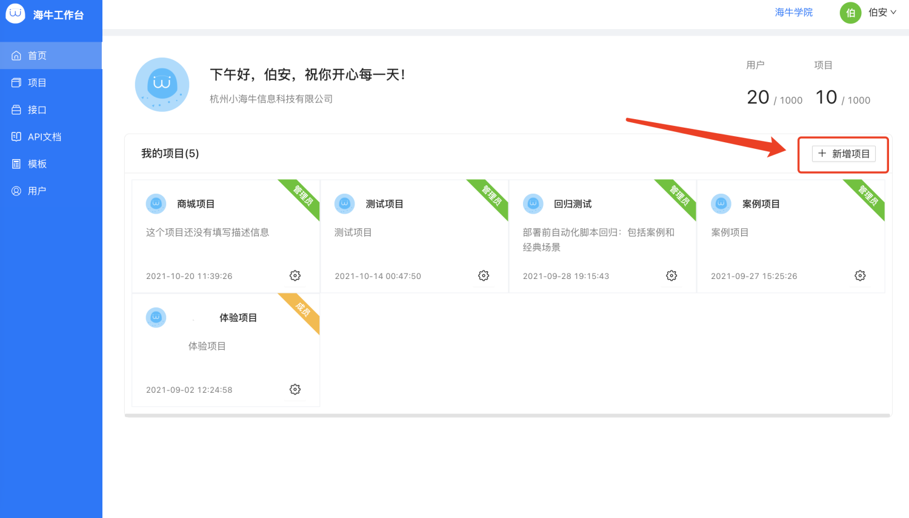
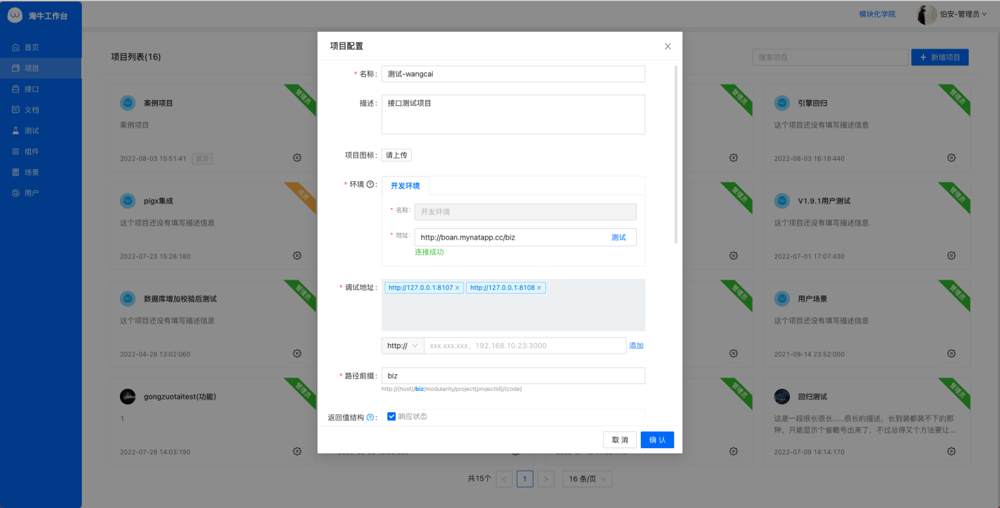
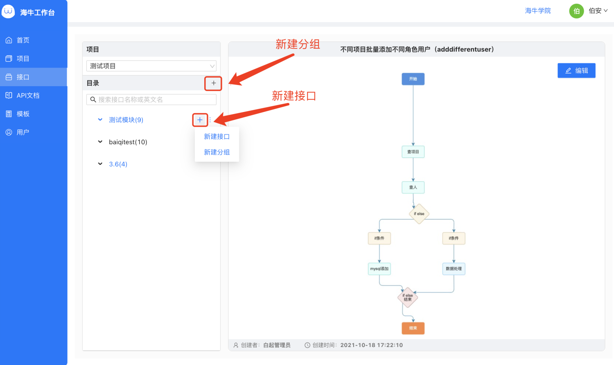
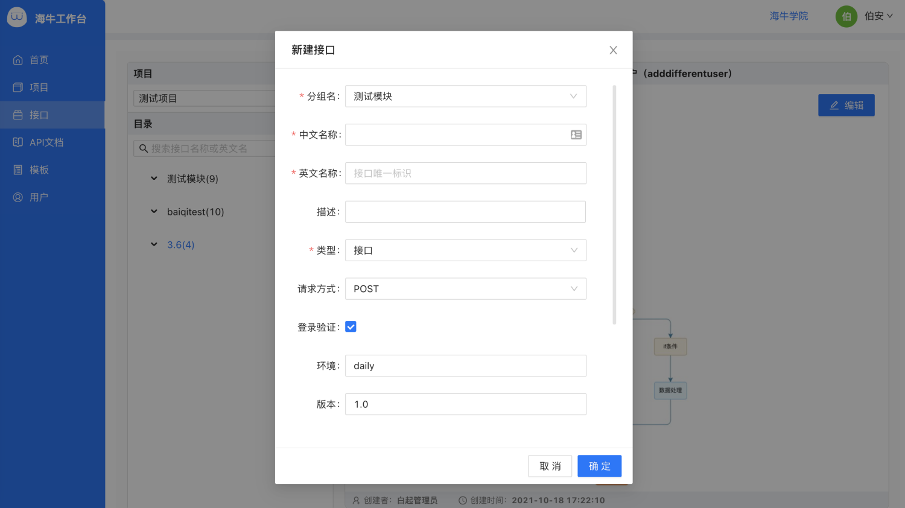
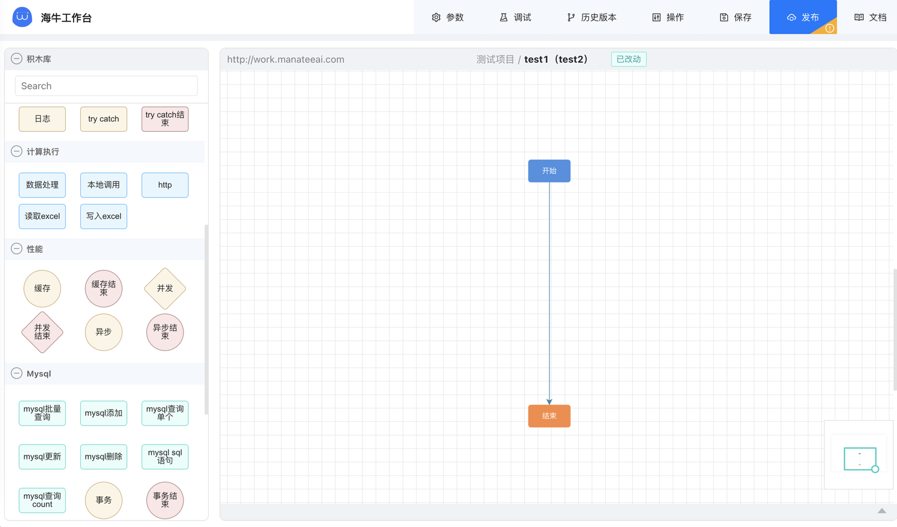

## 示例项目
[manatee-demo](https://manateeai.oss-cn-hangzhou.aliyuncs.com/demoProject/manatee-demo.zip)

下载后用 Idea 打开进行使用，需要将 application.yml 中数据库的地址，改成自己的数据库地址。
   

## 谷歌/Edge 浏览器设置

92 版本以下的不需要设置
地址栏进入：`chrome://flags/`

找到 `Block insecure private network requests` ，设置为 `disable`
点击浏览器底部弹出的 Relaunch 按钮，重启浏览器

## 项目开发
### 创建项目

#### 填写项目信息
填写名称、描述、环境地址和调试地址。
**环境地址**
**作用：**在更新项目配置、新增/编辑/发布接口时，将对应数据更新到项目数据库的 lowcode_base_module 和 lowcode_project_conf 表。
**要求：**要保证环境地址的访问是稳定的，不然会影响工作台开发项目的基本功能。
**说明：**不能是本地地址，**需要让外网访问到**，因为该地址的请求是从工作台所在服务器发起的。如: http://work.manateeai.com/biz。域名后需要加路径前缀，默认是 biz。
**方式：**
1. 专门在服务器上跑一个代理服务，此服务是一个集成了海牛的 springBoot 工程，工程里所配置的数据源和所开发项目的一样，它的作用只是为工作台开发该项目提供环境地址的访问。优点是稳定便捷，项目的重启和部署不影响工作台开发，缺点是要多部署一个服务。
2. 项目集成海牛后，跑在服务器上或者和工作台在一个网络下的地方，让工作台能够访问到。优点是不用额外跑一个服务了，缺点是项目部署重启时，会造成环境地址不通，工作台也暂时不能开发该项目。
3. 将本地内网穿透（测试可以，正式开发不推荐）。

**调试地址**   
**作用：**调试、测试、接口文档的执行等操作时，指定用哪个地址下的项目去执行，该项目充当调试执行引擎的角色。   
**要求：**无特殊要求，按需配置。如果不涉及调试等操作，该地址下项目没有跑起来不影响接口的创建、修改和发布。   
**说明：可以是项目的本机地址**，如: 127.0.0.1:8080，因为该地址的请求是从本地浏览器发起的。   
   
### 创建接口
创建好分组以后可以创建模块。   

#### 填写接口信息
填写名称、描述、请求方式   
英文名称是接口唯一标识，同一项目下不可重复   
选择接口类型、请求方式   

创建完毕，开始开发吧

